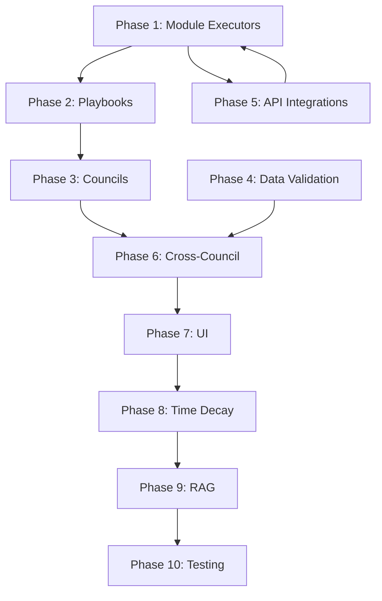

# 🚀 Master Implementation Plan - FON Gap Resolution

**Fecha de Creación:** 2025-12-18  
**Versión:** 1.0  
**Duración Estimada:** 8-10 semanas  
**Completitud Actual:** ~45%  
**Objetivo:** 95%+ completitud

---

## 📊 Resumen de Gaps Identificados

| ID | Categoría | Gap | Severidad | Esfuerzo | Prioridad |
|----|-----------|-----|-----------|----------|-----------|
| G01 | Module Executors | 14/16 módulos sin lógica real | 🔴 Crítico | Alto | P0 |
| G02 | Playbooks System | 0% implementado | 🔴 Crítico | Alto | P0 |
| G03 | Councils | 5/7 councils desactivados | 🟠 Alto | Medio | P1 |
| G04 | Data Validation | Zero Hallucination no implementado | 🟠 Alto | Medio | P1 |
| G05 | Cross-Council | Sin síntesis entre councils | 🟡 Medio | Medio | P2 |
| G06 | Insight Structure | `why_it_matters` inconsistente | 🟡 Medio | Bajo | P2 |
| G07 | Confidence UI | ConfidenceBar no obligatorio | 🟡 Medio | Bajo | P2 |
| G08 | API Integrations | DataForSEO/Ahrefs parciales | 🟠 Alto | Alto | P1 |
| G09 | Time Decay | Sin degradación temporal de datos | 🟡 Medio | Medio | P2 |
| G10 | RAG System | Actions Library sin embeddings | 🟡 Medio | Alto | P3 |

---

## 🗓️ Cronograma General

```
Semana 1-2:  [████████████████████] Phase 1: Module Executors Core
Semana 3-4:  [████████████████████] Phase 2: Playbooks System
Semana 5:    [██████████          ] Phase 3: Councils Activation
Semana 6:    [██████████          ] Phase 4: Data Validation
Semana 7:    [██████████          ] Phase 5: API Integrations
Semana 8:    [██████████          ] Phase 6: Cross-Council & Polish
Semana 9-10: [████████████████████] Phase 7: Testing & QA
```

---

## 📁 Estructura de Documentos

```
docs_2/implementation_plan/
├── 00_MASTER_IMPLEMENTATION_PLAN.md     (este archivo)
├── 01_MODULE_EXECUTORS_PLAN.md          (14 módulos)
├── 02_PLAYBOOKS_SYSTEM_PLAN.md          (sistema completo)
├── 03_COUNCILS_ACTIVATION_PLAN.md       (5 councils)
├── 04_DATA_VALIDATION_PLAN.md           (Zero Hallucination)
├── 05_API_INTEGRATIONS_PLAN.md          (DataForSEO, Ahrefs, Bright Data)
├── 06_CROSS_COUNCIL_SYNTHESIS_PLAN.md   (Master Council)
├── 07_UI_CONSISTENCY_PLAN.md            (ConfidenceBar, InsightBlock)
├── 08_TIME_DECAY_PLAN.md                (Signal aging)
├── 09_RAG_SYSTEM_PLAN.md                (Embeddings & search)
└── 10_TESTING_QA_PLAN.md                (E2E, Unit, Integration)
```

---

## 🎯 Phase 1: Module Executors (Semanas 1-2)

**Objetivo:** Implementar lógica real para los 14 módulos faltantes

### Módulos por Prioridad

| Prioridad | Módulo | Data Sources | Complejidad |
|-----------|--------|--------------|-------------|
| P0 | keyword-gap | Ahrefs | Alta |
| P0 | category-visibility | DataForSEO, Ahrefs | Alta |
| P0 | branded-demand | Google Trends | Media |
| P1 | breakout-terms | Google Trends | Media |
| P1 | emerging-competitor | Ahrefs | Alta |
| P1 | competitor-ads | Bright Data | Alta |
| P1 | link-authority | Ahrefs | Media |
| P2 | paid-organic-overlap | DataForSEO | Alta |
| P2 | priority-scoring | Internal | Media |
| P2 | deprioritization | Internal | Media |
| P2 | strategic-summary | Internal | Media |
| P2 | os-drop | Internal | Baja |
| P2 | market-momentum | Google Trends | Media |

**Entregables:**
- [ ] 14 ejecutores implementados en `backend/apps/reports/services.py`
- [ ] Tests unitarios para cada ejecutor
- [ ] Documentación de inputs/outputs

**Documento Detallado:** `01_MODULE_EXECUTORS_PLAN.md`

---

## 🎯 Phase 2: Playbooks System (Semanas 3-4)

**Objetivo:** Implementar sistema de playbooks que cargue y ejecute la lógica documentada

### Componentes

1. **PlaybookConfig Model**
   - Cargar desde YAML/JSON
   - Validación de estructura
   - Versionado

2. **Playbook Executor**
   - Integración con module executors
   - Council Reasoning Layer
   - Deprioritization Rules

3. **16 Playbooks**
   - Market Demand & Seasonality
   - Breakout Terms & Trend Alerts
   - Category Visibility Benchmark
   - ... (13 más)

**Entregables:**
- [ ] Modelo `PlaybookConfig` en Django
- [ ] Sistema de carga de playbooks
- [ ] Integración con `ReportService`
- [ ] 16 playbooks en formato YAML

**Documento Detallado:** `02_PLAYBOOKS_SYSTEM_PLAN.md`

---

## 🎯 Phase 3: Councils Activation (Semana 5)

**Objetivo:** Activar los 5 councils desactivados y conectarlos con módulos

### Councils a Activar

| Council | Módulos Gobernados |
|---------|-------------------|
| Performance Media & Messaging | Branded Demand, Paid/Organic, Competitor Ads |
| Creative & Funnel | (Supporting) Competitor Ads |
| Growth Strategy & Planning | Strategic Summary, Action Cards, Priority Scoring |
| Ops & Attribution | (Supporting) Paid/Organic, Deprioritization |
| Product & GTM Alignment | (Supporting) |

**Entregables:**
- [ ] 5 councils con `is_active: True`
- [ ] Mapeo módulo → council actualizado
- [ ] Tests de integración council-module

**Documento Detallado:** `03_COUNCILS_ACTIVATION_PLAN.md`

---

## 🎯 Phase 4: Data Validation (Semana 6)

**Objetivo:** Implementar "Zero Hallucination" principle

### Componentes

1. **Data Citation Validator**
   - Verificar que cada insight tenga `data_point` y `source`
   - Rechazar outputs sin evidencia

2. **Confidence Enforcement**
   - Calcular confidence basado en data quality
   - Degradar confidence si faltan fuentes

3. **Language Validator**
   - Detectar lenguaje especulativo
   - Forzar framing: "Based on available data..."

**Entregables:**
- [ ] `DataCitationValidator` class
- [ ] `ConfidenceCalculator` mejorado
- [ ] `LanguageValidator` para outputs
- [ ] Tests de validación

**Documento Detallado:** `04_DATA_VALIDATION_PLAN.md`

---

## 🎯 Phase 5: API Integrations (Semana 7)

**Objetivo:** Completar integraciones con APIs externas

### APIs

| API | Estado Actual | Objetivo |
|-----|---------------|----------|
| Google Trends | ✅ Completo | Mantener |
| Ahrefs | ⚠️ Parcial | Completar |
| DataForSEO | ⚠️ Parcial | Completar |
| Bright Data | ❌ No implementado | Implementar |
| SERPAPI | ❌ No implementado | Implementar |

**Entregables:**
- [ ] `AhrefsService` completo
- [ ] `DataForSEOService` completo
- [ ] `BrightDataService` nuevo
- [ ] `SERPAPIService` nuevo
- [ ] Rate limiting y caching

**Documento Detallado:** `05_API_INTEGRATIONS_PLAN.md`

---

## 🎯 Phase 6: Cross-Council Synthesis (Semana 8)

**Objetivo:** Implementar síntesis entre councils

### Componentes

1. **Master Synthesis Council**
   - Agregar perspectivas de todos los councils
   - Resolver conflictos entre councils
   - Generar recomendación unificada

2. **Council Arbitration**
   - Weighted voting basado en `decision_authority`
   - Conflict detection
   - Consensus building

**Entregables:**
- [ ] `MasterSynthesisCouncil` class
- [ ] `CouncilArbitrator` class
- [ ] Integración con `ExecutiveSummary`

**Documento Detallado:** `06_CROSS_COUNCIL_SYNTHESIS_PLAN.md`

---

## 🎯 Phase 7: UI Consistency (Semana 8)

**Objetivo:** Estandarizar componentes UI según documentación

### Componentes

1. **ConfidenceBar Obligatorio**
   - Agregar a todos los módulos
   - Estilo ENSO consistente

2. **InsightBlock Mejorado**
   - `why_it_matters` obligatorio
   - Source labels visibles
   - Data point destacado

3. **RecommendationCard**
   - Priority badge
   - Estimated impact
   - Effort indicator

**Entregables:**
- [ ] `ConfidenceBar` en todos los módulos
- [ ] `InsightBlock` actualizado
- [ ] `RecommendationCard` estandarizado
- [ ] Design tokens documentados

**Documento Detallado:** `07_UI_CONSISTENCY_PLAN.md`

---

## 🎯 Phase 8: Time Decay (Semana 9)

**Objetivo:** Implementar degradación temporal de señales

### Componentes

1. **Time Decay Service**
   - Calcular freshness de datos
   - Degradar confidence con el tiempo
   - Alertar sobre datos stale

2. **Signal Aging Rules**
   - Google Trends: 7 días = 100%, 30 días = 70%, 90 días = 40%
   - Ahrefs: 30 días = 100%, 90 días = 80%
   - Competitor data: 14 días = 100%

**Entregables:**
- [ ] `TimeDecayService` class
- [ ] Configuración de decay rules
- [ ] UI indicators para data freshness

**Documento Detallado:** `08_TIME_DECAY_PLAN.md`

---

## 🎯 Phase 9: RAG System (Semana 9-10)

**Objetivo:** Implementar búsqueda semántica en Actions Library

### Componentes

1. **Embeddings Pipeline**
   - Generar embeddings para playbooks
   - Generar embeddings para actions
   - Almacenar en ChromaDB

2. **Semantic Search**
   - Buscar actions relevantes por contexto
   - Ranking por relevancia
   - Filtros por council/module

**Entregables:**
- [ ] `EmbeddingsService` class
- [ ] ChromaDB collections configuradas
- [ ] `ActionSearchService` class
- [ ] API endpoint para búsqueda

**Documento Detallado:** `09_RAG_SYSTEM_PLAN.md`

---

## 🎯 Phase 10: Testing & QA (Semana 10)

**Objetivo:** Cobertura de tests >80%

### Tipos de Tests

| Tipo | Cobertura Actual | Objetivo |
|------|------------------|----------|
| Unit Tests | ~30% | 80% |
| Integration Tests | ~20% | 70% |
| E2E Tests | ~10% | 50% |

**Entregables:**
- [ ] Tests unitarios para todos los services
- [ ] Tests de integración para API endpoints
- [ ] Tests E2E para flujos críticos
- [ ] CI/CD pipeline actualizado

**Documento Detallado:** `10_TESTING_QA_PLAN.md`

---

## 📈 Métricas de Éxito

| Métrica | Actual | Objetivo |
|---------|--------|----------|
| Módulos Funcionales | 12.5% | 100% |
| Councils Activos | 28.5% | 100% |
| Playbooks Implementados | 0% | 100% |
| Test Coverage | ~25% | 80% |
| API Integrations | 40% | 100% |
| UI Consistency | 70% | 95% |

---

## 🔄 Dependencias entre Phases



---

## 👥 Recursos Requeridos

| Rol | Dedicación | Semanas |
|-----|------------|---------|
| Backend Developer | 100% | 1-10 |
| Frontend Developer | 50% | 5-10 |
| AI/ML Engineer | 50% | 3-4, 9 |
| QA Engineer | 100% | 9-10 |

---

## ⚠️ Riesgos y Mitigaciones

| Riesgo | Probabilidad | Impacto | Mitigación |
|--------|--------------|---------|------------|
| API rate limits | Alta | Alto | Implementar caching agresivo |
| Complejidad de playbooks | Media | Alto | Empezar con 3 playbooks piloto |
| Council conflicts | Media | Medio | Definir reglas de arbitraje claras |
| Test coverage | Alta | Medio | TDD desde Phase 1 |

---

## 📝 Notas

- Seguir principio HADID: Iterar, no perfeccionar
- Cada phase debe tener demo funcional
- Documentar decisiones en ADRs
- Code review obligatorio para cada PR

---

*Documento vivo - Actualizar según progreso*
