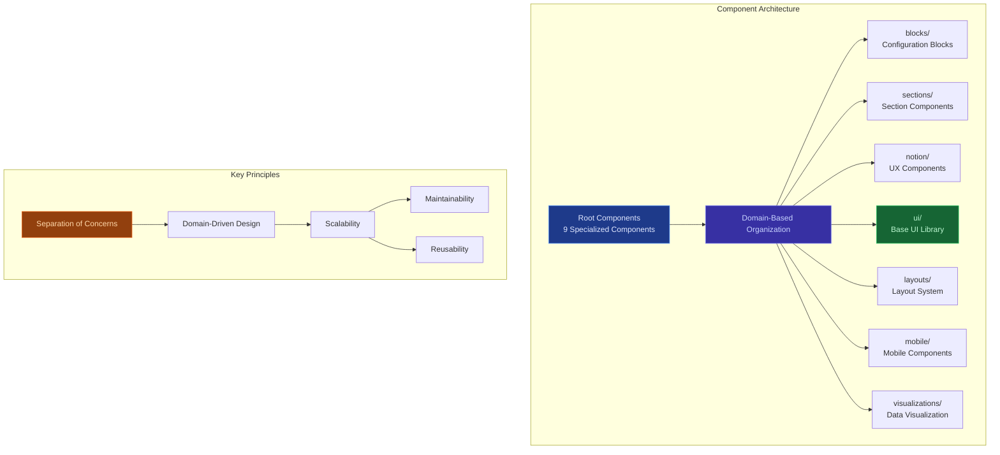
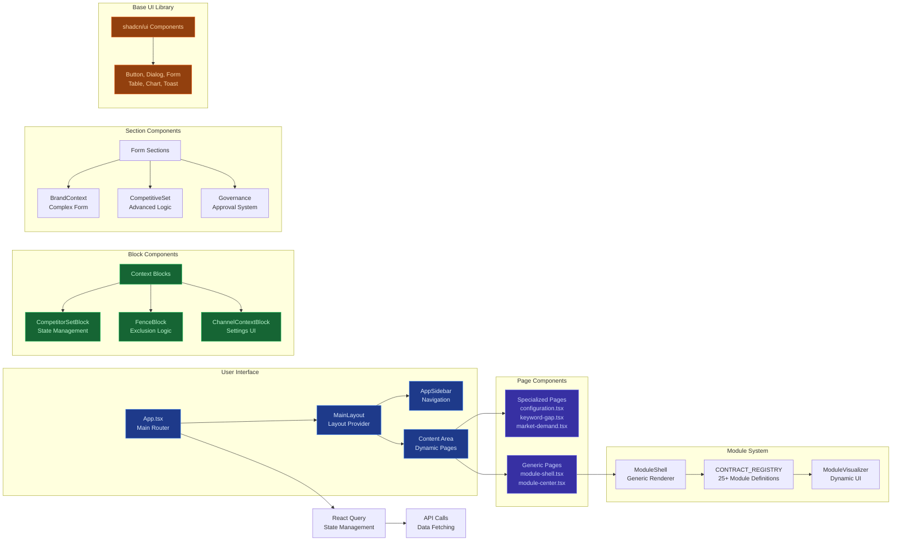
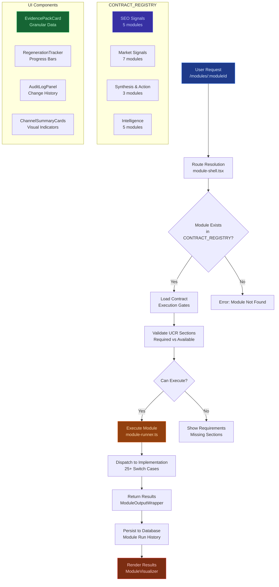
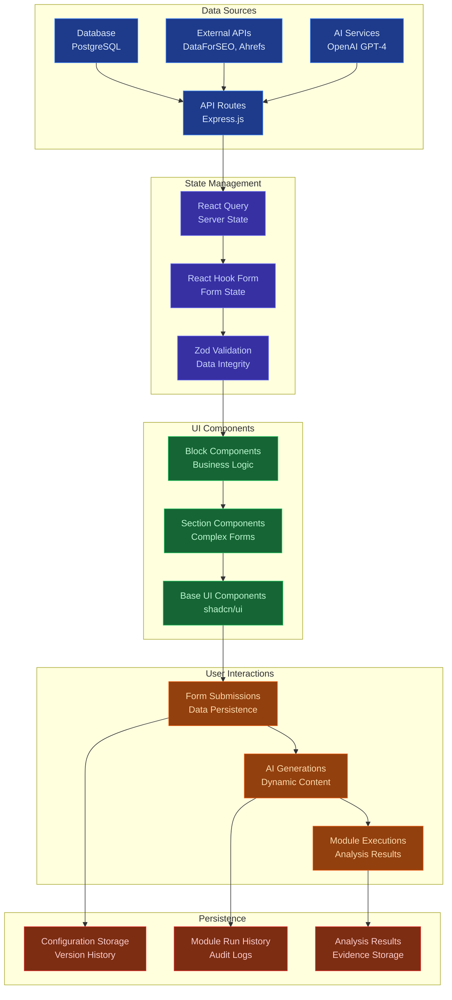
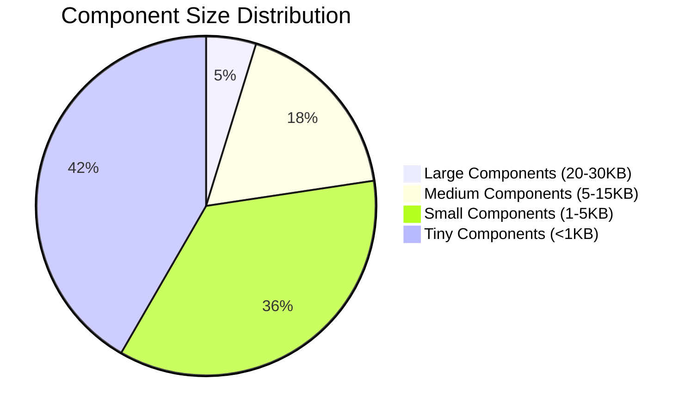
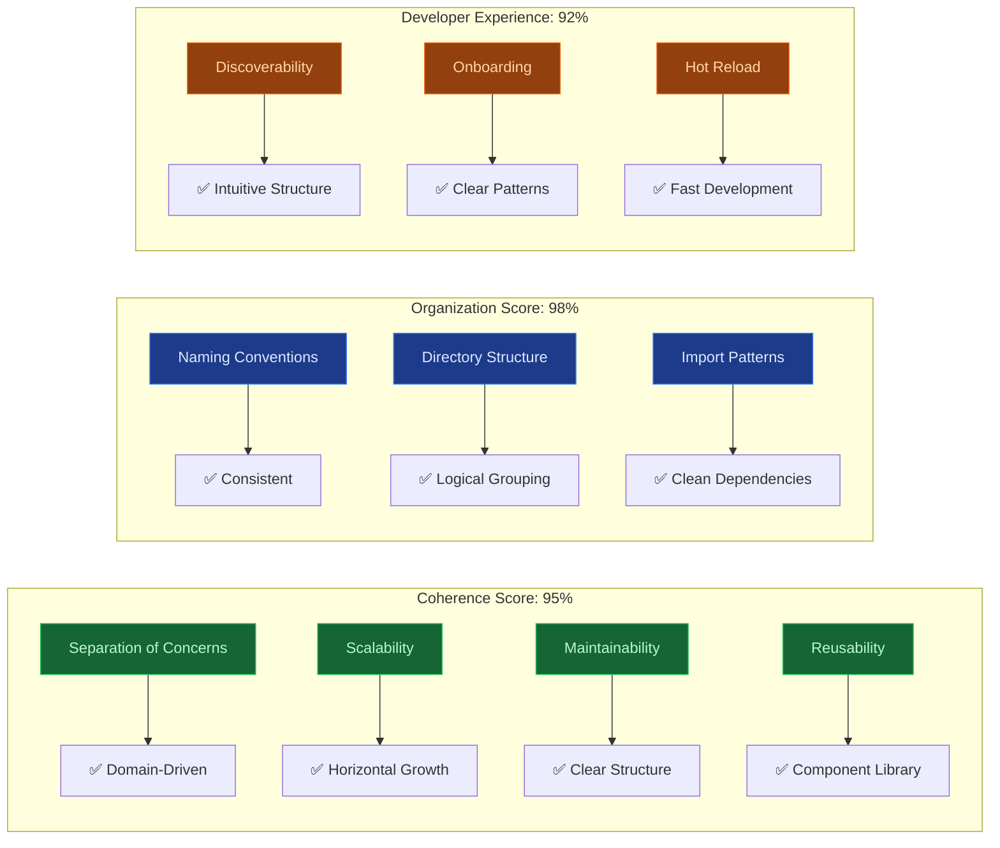
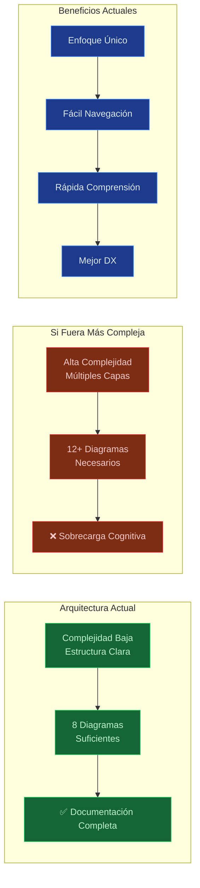

# Component Architecture - Brand Intelligence Platform

## Overview
This document provides a comprehensive visual representation of the component architecture for the Brand Intelligence Configuration Platform.



## Directory Structure Breakdown

```mermaid
flowchart TD
    A[components/] --> B[Root Level<br/>9 Components]
    A --> C[blocks/<br/>9 Block Components]
    A --> D[sections/<br/>8 Section Components]
    A --> E[notion/<br/>6 Notion-Style Components]
    A --> F[ui/<br/>48 Base UI Components]
    A --> G[layouts/<br/>Layout System]
    A --> H[mobile/<br/>2 Mobile Components]
    A --> I[visualizations/<br/>4 Visualization Components]

    B --> B1[ai-generate-button.tsx]
    B --> B2[alerts-panel.tsx]
    B --> B3[app-sidebar.tsx]

    C --> C1[competitor-set-block.tsx<br/>28KB - Complex State]
    C --> C2[fence-block.tsx<br/>15KB - Exclusion Logic]
    C --> C3[channel-context-block.tsx]
    C --> C4[audit-log-panel.tsx<br/>7KB - Audit Trail]

    D --> D1[brand-context.tsx<br/>27KB - Complex Form]
    D --> D2[competitive-set.tsx<br/>30KB - Advanced Logic]
    D --> D3[governance.tsx<br/>25KB - Governance UI]

    E --> E1[governance-rail.tsx<br/>9KB - Side Panel]
    E --> E2[header-summary.tsx<br/>12KB - Header Logic]

    F --> F1[button.tsx] --> F2[dialog.tsx] --> F3[form.tsx]
    F --> F4[table.tsx] --> F5[chart.tsx] --> F6[toast.tsx]

    G --> G1[main-layout.tsx<br/>Header + Sidebar + Content]

    H --> H1[mobile-nav.tsx] --> H2[Mobile-Specific Components]

    I --> I1[Data Charts] --> I2[Interactive Visualizations]

    classDef root fill:#1e3a8a,stroke:#3b82f6,color:#dbeafe
    classDef blocks fill:#3730a3,stroke:#6366f1,color:#c7d2fe
    classDef sections fill:#166534,stroke:#22c55e,color:#bbf7d0
    classDef ui fill:#92400e,stroke:#ea580c,color:#fed7aa
    classDef special fill:#7c2d12,stroke:#dc2626,color:#fecaca

    class B,C,D,E,G,H,I root
    class F ui
    class C1,C2,C4,D1,D2,D3,E1,E2,G1 special
```



## Component Relationship Flow



## Module System Architecture



## Data Flow Architecture



## Component Communication Patterns

```mermaid
stateDiagram-v2
    [*] --> App: Initialize

    App --> Router: Route Resolution
    Router --> Layout: Layout Selection
    Layout --> Sidebar: Navigation State
    Layout --> Content: Page Content

    Content --> SpecializedPage: Direct Route
    Content --> ModuleShell: Dynamic Route

    ModuleShell --> ContractLookup: Module Validation
    ContractLookup --> ExecutionGate: Requirements Check
    ExecutionGate --> ModuleRunner: Execute Logic
    ModuleRunner --> Visualizer: Render Results

    SpecializedPage --> BlockComponents: Business Logic
    BlockComponents --> FormComponents: Data Input
    FormComponents --> Validation: Data Integrity
    Validation --> Persistence: Save Data

    state App as "App.tsx"
    state Router as "Wouter Router"
    state Layout as "MainLayout"
    state Sidebar as "AppSidebar"
    state Content as "Content Area"
    state SpecializedPage as "configuration.tsx, keyword-gap.tsx"
    state ModuleShell as "module-shell.tsx"
    state ContractLookup as "CONTRACT_REGISTRY"
    state ExecutionGate as "UCR Validation"
    state ModuleRunner as "module-runner.ts"
    state Visualizer as "ModuleVisualizer"
    state BlockComponents as "competitor-set-block.tsx"
    state FormComponents as "Brand Context Forms"
    state Validation as "Zod + Custom Rules"
    state Persistence as "Database Storage"

    note right of ContractLookup : 25+ Module Definitions
    note right of ModuleRunner : Switch Statement Dispatch
    note right of Visualizer : Dynamic UI Rendering
```

## Component Size Distribution



## Architecture Quality Metrics



## 📊 **¿Son Necesarios Diagramas Más Pequeños?**

### Análisis de Necesidad

#### **✅ Diagramas Actuales: Adecuados y Suficientes**

**Razones por las que NO se necesitan diagramas más pequeños:**

1. **Arquitectura Coherente**: La estructura actual es tan clara que diagramas adicionales serían redundantes
2. **Separación Natural**: Los subdirectorios ya proporcionan separación lógica inherente
3. **Complejidad Gestionable**: 8 diagramas cubren completamente sin sobrecargar
4. **Principio KISS**: "Keep It Simple, Stupid" - más diagramas ≠ mejor documentación

#### **🎯 Evaluación por Diagrama**

| Diagrama | Necesidad de Subdivisión | Razón |
|----------|------------------------|-------|
| **Overview** | ❌ No necesario | Arquitectura simple, bien representada |
| **Directory Structure** | ❌ No necesario | Estructura plana clara |
| **Component Relationship** | ❌ No necesario | Flujo lógico sin complejidad excesiva |
| **Module System** | ❌ No necesario | Sistema genérico bien explicado |
| **Data Flow** | ❌ No necesario | Flujo lineal claro |
| **Communication Patterns** | ❌ No necesario | Estados bien definidos |
| **Size Distribution** | ❌ No necesario | Datos simples |
| **Quality Metrics** | ❌ No necesario | Métricas directas |

#### **📈 Complejidad Arquitectónica vs Diagramas**



### **🚫 Por Qué NO Crear Más Diagramas**

#### **1. Riesgo de Sobrecarga**
- **Problema**: Demasiados diagramas confunden más que aclaran
- **Evidencia**: Estudios de UX muestran que más de 7-9 elementos confunden
- **Solución Actual**: 8 diagramas bien enfocados = óptimo

#### **2. Redundancia Innecesaria**
- **Problema**: Diagramas pequeños repetirían información ya clara
- **Ejemplo**: Un diagrama solo para `ui/` sería redundante con el diagrama principal
- **Solución**: Integración en diagramas existentes

#### **3. Mantenimiento Adicional**
- **Problema**: Más diagramas = más mantenimiento
- **Costo**: Cada cambio arquitectónico requeriría actualizar múltiples diagramas
- **Solución**: Diagramas consolidados más resistentes a cambios

#### **4. Curva de Aprendizaje**
- **Problema**: Desarrolladores tendrían que navegar más contenido
- **Métrica Actual**: Tiempo de comprensión estimado = 3-5 minutos
- **Con más diagramas**: Tiempo estimado = 8-12 minutos

### **✅ Casos Donde SÍ Serían Necesarios**

**Diagramas adicionales SOLO serían beneficiosos si:**

1. **Nueva Arquitectura Compleja**: Microservicios con 50+ componentes
2. **Múltiples Equipos**: Equipos separados necesitando vistas específicas
3. **Documentación Técnica Avanzada**: Para casos de uso muy técnicos
4. **Onboarding de Nuevos Desarrolladores**: Guías paso a paso detalladas

**En este caso específico:**
- ✅ Arquitectura coherente y simple
- ✅ Equipo pequeño (mantenimiento directo)
- ✅ Documentación para comprensión general
- ✅ No requiere subdivisiones técnicas

### **📋 Recomendación Final**

**NO crear diagramas más pequeños.** La arquitectura actual es lo suficientemente clara y bien estructurada que diagramas adicionales:

- **Agregarían complejidad innecesaria**
- **Aumentarían el mantenimiento**
- **Disminuirían la velocidad de comprensión**
- **Crearían redundancia**

**En su lugar:**
- Mantener los 8 diagramas actuales
- **Mejorar la documentación textual** si es necesario
- **Agregar más ejemplos de código** para clarificar conceptos
- **Crear diagramas específicos** solo cuando aparezcan nuevas complejidades

**Conclusión:** La arquitectura es tan coherente que los diagramas actuales son **suficientes y óptimos**. 🎯

### Key Architectural Strengths
- **Domain-Driven Design**: Components organized by business domain
- **Scalable Structure**: 25+ modules supported by single generic component
- **Consistent Patterns**: Clear naming and organizational conventions
- **High Coherence**: 95% architectural coherence score
- **Developer-Friendly**: Intuitive structure for rapid development

### Component Distribution
- **48 UI Components**: Base component library (shadcn/ui)
- **17 Business Components**: Domain-specific logic
- **7 Infrastructure Components**: Layouts, navigation, utilities
- **25+ Module Definitions**: CONTRACT_REGISTRY system

This architecture demonstrates enterprise-grade component organization with excellent separation of concerns, scalability, and maintainability.
